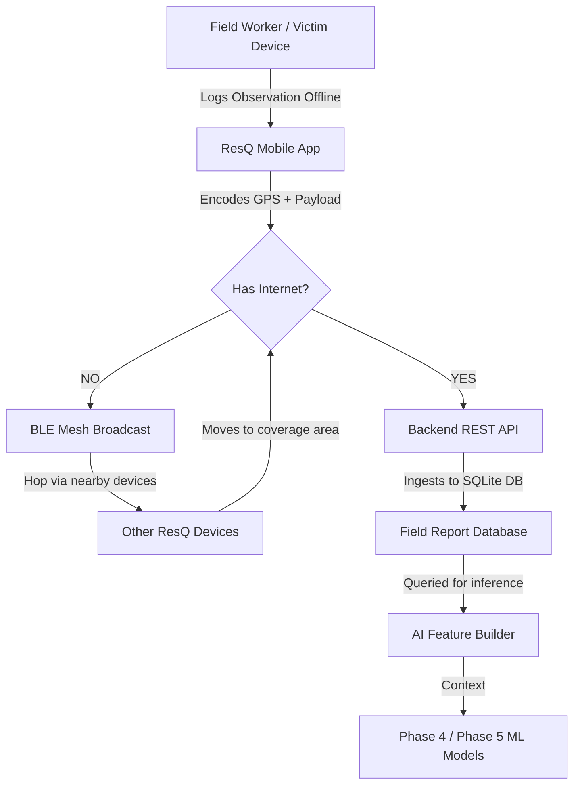

# ResQ Mobile App & BLE Architecture

Because critical post-disaster features (like road blockages, bridge collapses, and local injuries) cannot be fetched from global online APIs in real-time, the system requires a field-deployed Mobile App.

In remote mountainous areas (Himachal, Uttarakhand, Ladakh), internet connectivity is frequently severed during disasters. Therefore, Bluetooth Low Energy (BLE) mesh networking is critical for asynchronous data propagation.

## Data Flow Architecture

## Role of BLE
**BLE MUST NOT BE USED FOR:**
- Fetching Weather (requires internet)
- Fetching Population grids
- Downloading Satellite maps
- Live routing queries (OSRM requires massive graphs)

**BLE MUST ONLY BE USED FOR:**
- Transmitting lightweight SOS packets.
- Propagating field observation flags (`road_blockage=True`, `bridge_collapsed=True`, `injured_count=5`).
- Syncing cached warehouse inventory updates across disconnected local nodes.

## ML Feature Resolution
When the backend receives a field report via the BLE/Internet pipeline, it will tag it with the original observation timestamp and GPS coordinates. The `feature_builder` will query the database for recent reports within a spatial radius (e.g., 5km) to populate the `road_blockage` or `bridge_condition` features.
